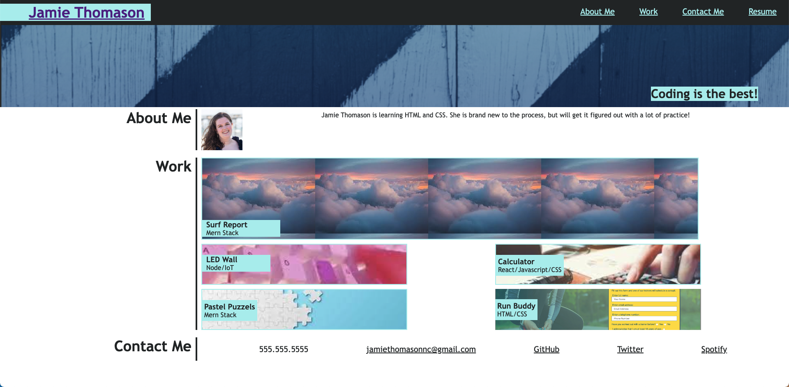

# J-Thomason-Portfolio

[Click here for access Jamie Thomason's Portfolio Website](https://jamiethomason.github.io/J-Thomason-Portfolio/)

## Site Creation Steps
1. Outlined HTML based on mockup image.
2. Filled in CSS characteristics for style, spacing, and responsiveness.
3. Added in Section IDs and links to make site functional. 

## Website Preview
Below is an image of the website's appearance:

